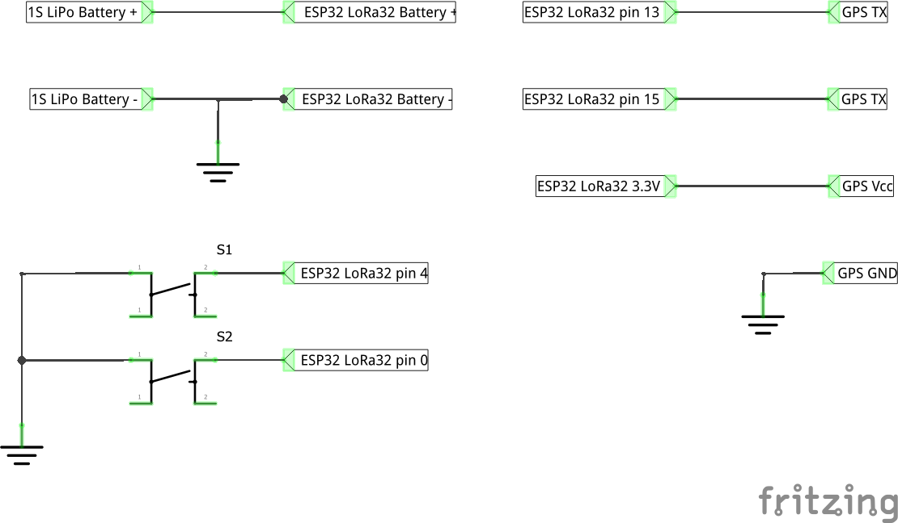

# QmuBeaconLocator

QmuBeaconLocator stands for QuadMeUp Beacon Locator and is a part of QmuBeacon project which consists of:

* [QmuBeacon](https://github.com/DzikuVx/QmuBeacon) - radio beacon that can be installed on any device to be tracked (airplane, drone, car, person?)
* [QmuBeaconLocator](https://github.com/DzikuVx/QmuBeaconLocator) - receiver part of the QmuBeacon that allows to locate beacons in range

# Required libraries

To compile QmuBeacon you will need some external libraries that are not part of this repository. Those are:

* [TinyGPS++](https://github.com/mikalhart/TinyGPSPlus)
* [QmuTactile](https://github.com/DzikuVx/QmuTactile)

# Hardware

* [TTGO LORA32 ESP32 board](http://bit.ly/2BjG47d)
* [BN-220](http://bit.ly/2B8h5jV) or [BN-180](http://bit.ly/2VqHuSF) or [BN-880](http://bit.ly/2OxW5by) GPS module
* [1S 3.7V LiIon battery](http://bit.ly/2Up7TnE)
* Any 868/915Mhz antenna
* 2 [tactile buttons](http://bit.ly/2UqsWpY)

# More about

You can see more about this project in following videos

* [https://www.youtube.com/watch?v=ve5t_pRLi8U](https://www.youtube.com/watch?v=ve5t_pRLi8U)
* [https://www.youtube.com/watch?v=46_azIkKsvs](https://www.youtube.com/watch?v=46_azIkKsvs)
* [https://www.youtube.com/watch?v=FtLlBvzTjec](https://www.youtube.com/watch?v=FtLlBvzTjec)